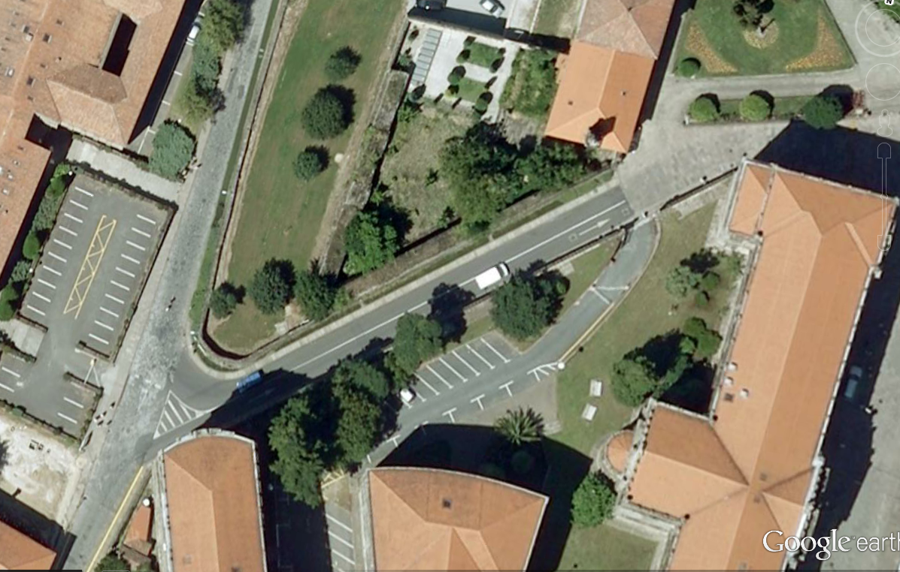
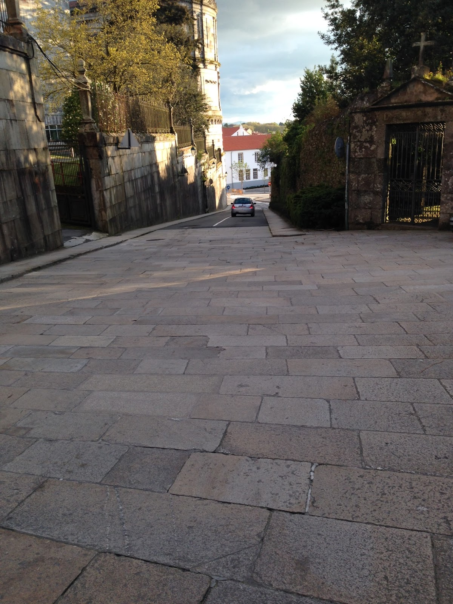

+++
title = "PROPOSTA DE MELLORA VIAL na COSTA DE SAN FRANCISCO"
date = "2016-06-07T12:57:20+02:00"
tags = ["veciñanza"]
categories = ["propostas"]
banner = "aerea.png"
authors = ["Composcleta"]
years = ["2016"]
+++

1º-Deixar un só carril de coches de baixada (podería ser de subida). Do mesmo ancho, e a partir do seto existente. (ou deixando a beirarrúa da dereita, baixando tal e como está)

2º- Ampliar a beirarrúa esquerda (baixando) ata 2m mínimo. Desaparece a outra beirarrúa.

3º-Engadir un carril bici, a compartir cos peóns, de 1m mínimo,en sentido de subida,  ao lado da beirarrúa e ao mesmo nivel que esta.

## Porqué?

- Mellora da **seguridade vial** e da humanización urbana
- **Reducción de conflictos** provocados polo tráfico no entronque da rúa de San Francisco
- Suporá dispor dunha beirarrúa de uso compartido peonil-bici de 3 m que fará moito mais **agradable** pasear por esta rúa.
- **Económica**: en tanto se pode realizar en 2 fases, na primeira só se empregaría pintura, e algúns cono anclados, para limitar o vial dos vehículos.

## Situación Actual

Dende a Asociación Composcleta detectamos problemas de diseño no tráfico na Costa de San Francisco que afectan seriamente á seguridade vial e imposibilitan un desplazamento a pé  tranquilo que merece calquera persoa que se desplaza polo casco histórico.

Os principais defectos deste deseño ineficiente e perigoso son:

1. A beirarrúa da dereita (baixando) é moi estreita, inviable para carros de bebé ou pais con nenos, e compartida con un seto.

2. A beirarrúa da dereita (baixando) no leva a ningures, inviable para carros de bebé ou pais con nenos.

3. A vía non ten ancho suficiente para que se crucen dous coches con seguridade para eles e para os peóns.

4. A beirarrúa da esquerda (baixando), ten só 90 centímetros de ancho e os coches pasan rozando aos peóns.

