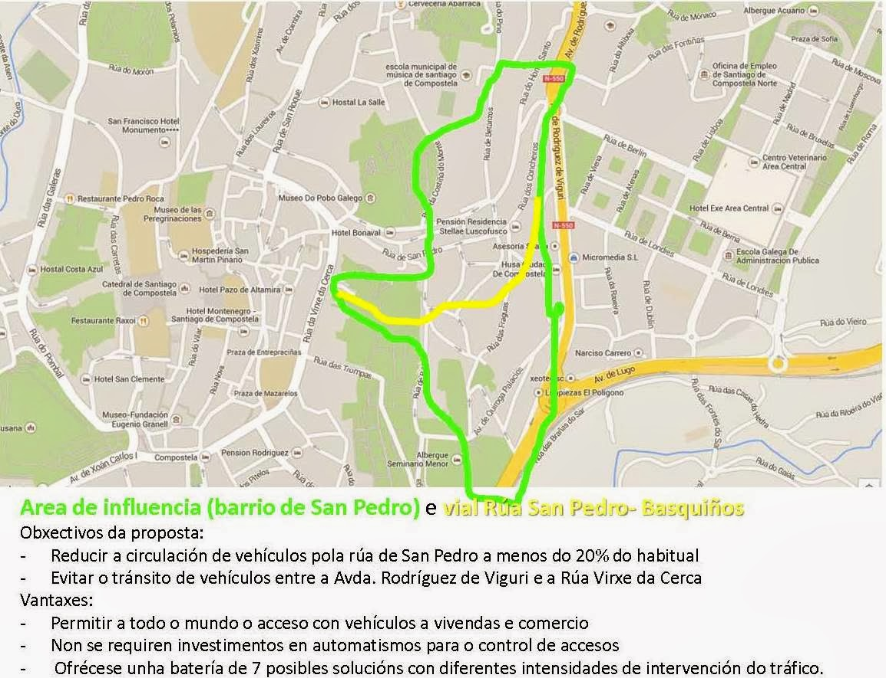
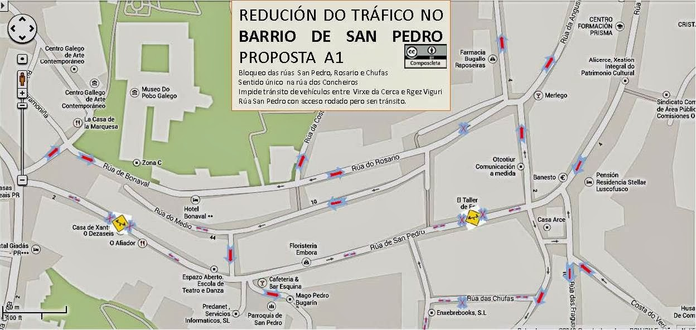
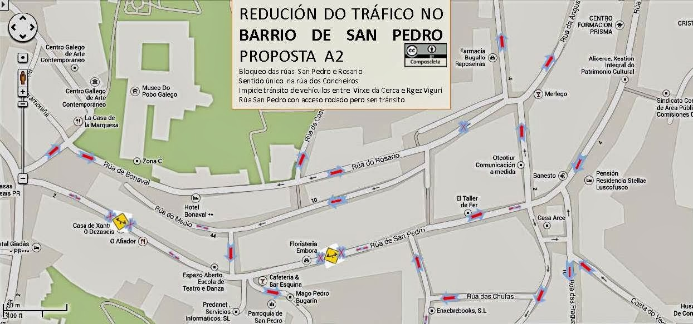
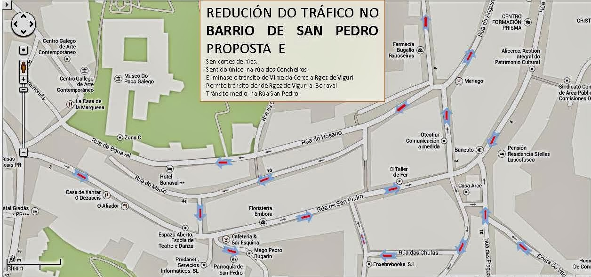
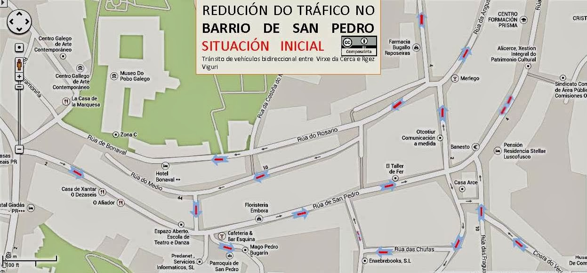

+++
title = "Barrio de San Pedro: Propostas para unha mobilidade equilibrada"
date = "2016-06-08T12:57:20+02:00"
tags = ["veciñanza"]
categories = ["propostas"]
banner = "mapa-ciudad.png"
authors = ["Manuel"]
years = ["2016"]
+++

Dende a Asociación Composcleta somos sensibles ás solucións de tráfico que se adoptan en Santiago de Compostela.
A situación da rúa de San Pedro e a solución que se adopte non pode sernos allea.
A continuación presentamos un ábaco de propostas coa finalidade de conseguir una cidade máis habitable para as persoas.

O documento presenta 7 mapas con distintas propostas de tráfico de maior a menor grao de intervención.
Todas as propostas teñen os seguintes obxectivos:
Eliminar os vehículos en tránsito polo barrio de San Pedro
Permitir aos vecinos e visitantes o acceso en coche a todas as viviendas e comercios do barrio.

Descripción dos mapas do documento:

## 1 SITUACIÓN DO BARRIO DE SAN PEDRO E RÚA DE SAN PEDRO

Obsérvade que a pesar da súa posición central: O barrio non ten unha alta concentración de habitantes A rúa de San Pedro é o enlace natural de Área Central coa cidade vella e o Ensanche. Indícanse tamén os viais de características urbáns que fan función de travesía, incrementando a conflictividad circulatoria. Incluída la propia Rúa de San Pedro.

## 2 AREA DE INFLUENCIA (BARRIO DE SAN PEDRO) E VIAL RÚA SAN PEDRO- BASQUIÑOS

Indícase a area afectada polas propostas: se extende a todo o barrio de San Pedro e rúa do Home Santo.

## 3 PROPOSTA A1

Bloqueo das rúas San Pedro, Rosario e Chufas Sentido único na rúa dos Concheiros. Impide tránsito de vehículos entre Virxe da Cerca e Rodrígez de Viguri. Rúa San Pedro con acceso rodado pero sen tránsito

## 4 PROPOSTA A2

Bloqueo das rúas San Pedro e Rosario Sentido único na rúa dos Concheiros. Impide tránsito de vehículos entre Virxe da Cerca e Rgez Viguri Rúa San Pedro con acceso rodado pero sen tránsito.

## 5 PROPOSTA B1

Bloqueo deas rúas San Pedro, Rosario e Chufas Sentido único na rúa dos Concheiros. Impide tránsito de vehículos entre Virxe da Cerca e Rgez Viguri Rúa San Pedro con acceso rodado e tránsito moderado.

## 6 PROPOSTA B2

Bloqueo das rúas San Pedro e Rosario Sentido único na rúa dos Concheiros. Impide tránsito de vehículos entre Virxe da Cerca e Rgez Viguri Rúa San Pedro con acceso rodado e tránsito moderado.

## 7 PROPOSTA C

Bloqueo da rúa San Pedro Sentido único na rúa dos Concheiros. Permite paso de bus por rúa do Rosario dende Rgez Viguri a Virxe da Cerca. Tránsito moderado na mitad da Rúa San Pedro

## 8 PROPOSTA E

Sen cortes de rúas. Sentido único na rúa dos Concheiros. Elimínase o tránsito de Virxe da Cerca a Rgez de Viguri. Permite tránsito dende Rgez de Viguri a Bonaval. Tránsito medio na Rúa San Pedro

## 9 SITUACIÓN INICIAL

Tránsito de vehículos bidireccional entre Virxe da Cerca e Rgez Viguri

